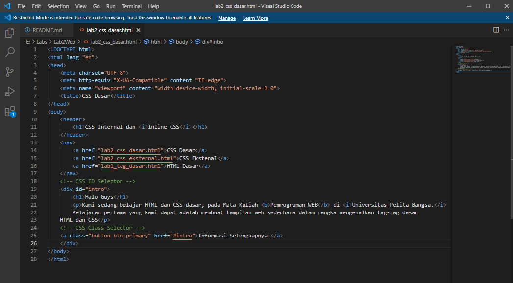
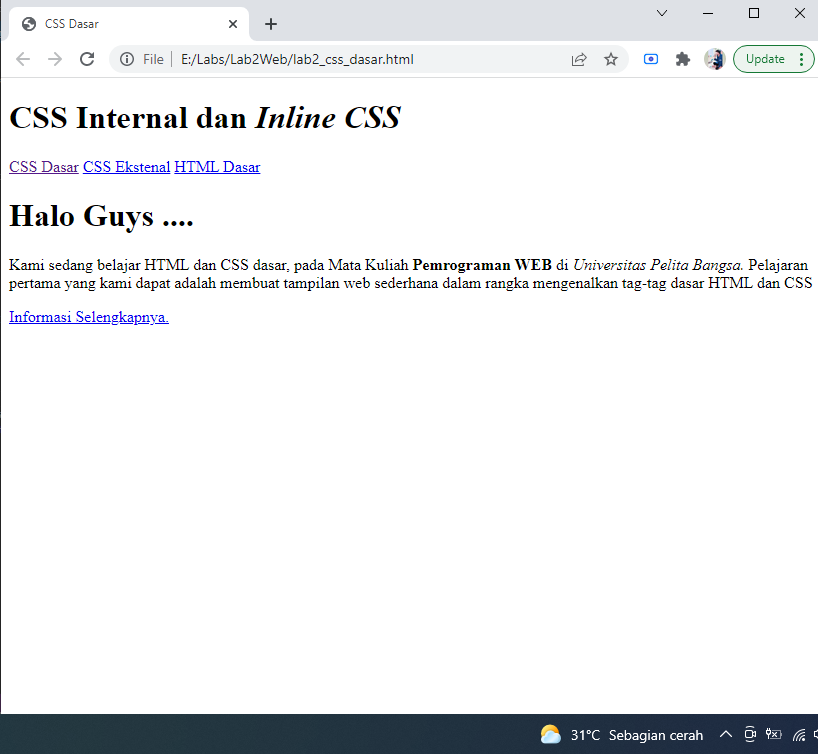
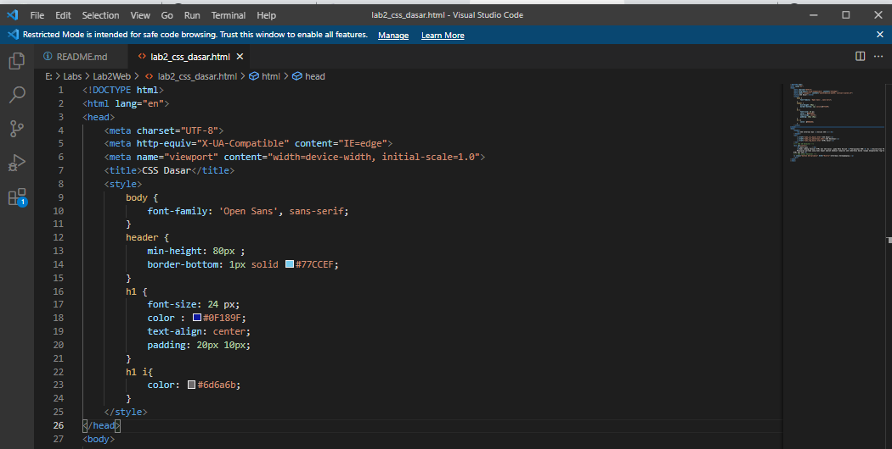
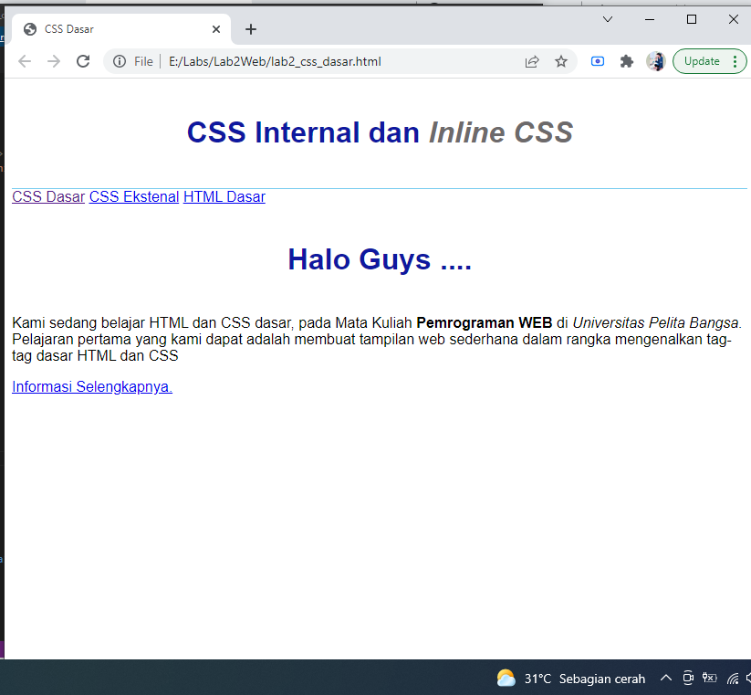
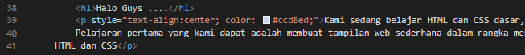
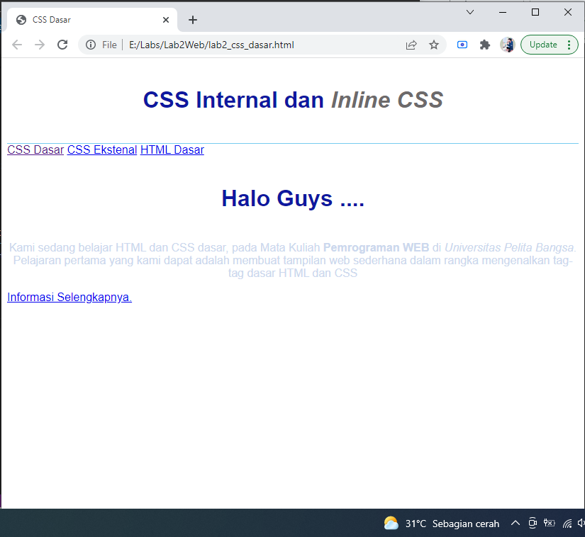
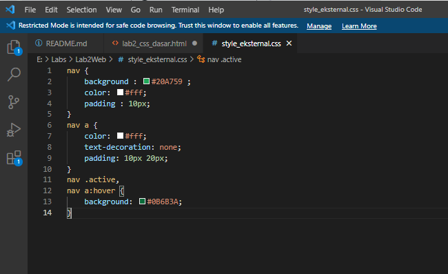
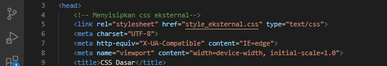
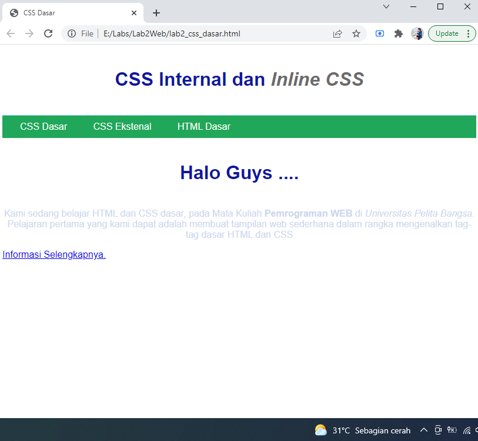

# Lab2Web
## Belajar CSS Internal dan Inline CSS

### Membuat Dokumen HTML 

Langkah pertama membuat contoh dokumen html terlebih dahulu.
Untuk lebih jelasnya bisa dilihat contoh codingan di bawah ini :

dan tampilan di web nya seperti ini :

### Menambahkan Deklarasi CSS Internal 

Langkah selanjutnya dalam praktikum kali ini adalah menambahkan deklarasi CSS Internal,
tambahkan pada bagian head, contoh nya seperti ini :

Tampilan Website nya akan seperti gambar dibawah ini, Perhatikan bagian judulnya

### Menambahkan Inline CSS

Selanjutnya tambahkan deklarasi Inline CSS pada tag `
` Contoh Codingannya seperti ini :

kita lihat tampilan paragraf pada Website nya jadi seperti ini :

### Menambahkan CSS Eksternal 

Langkah awal kita buat file nya terlebih dahulu, Contohnya seperti gambar dibawah ini :

Kemudian save file CSS Eksternal berikut di dalam folder yang sama, 
kemudian tambahkan tag `<link>` untuk merujuk ke file CSS yang sudah dibuat pada bagian `<head>` tadi.
Contoh codingan nya seperti ini :

Kita lihat tampilan Website nya jadi seperti ini 

